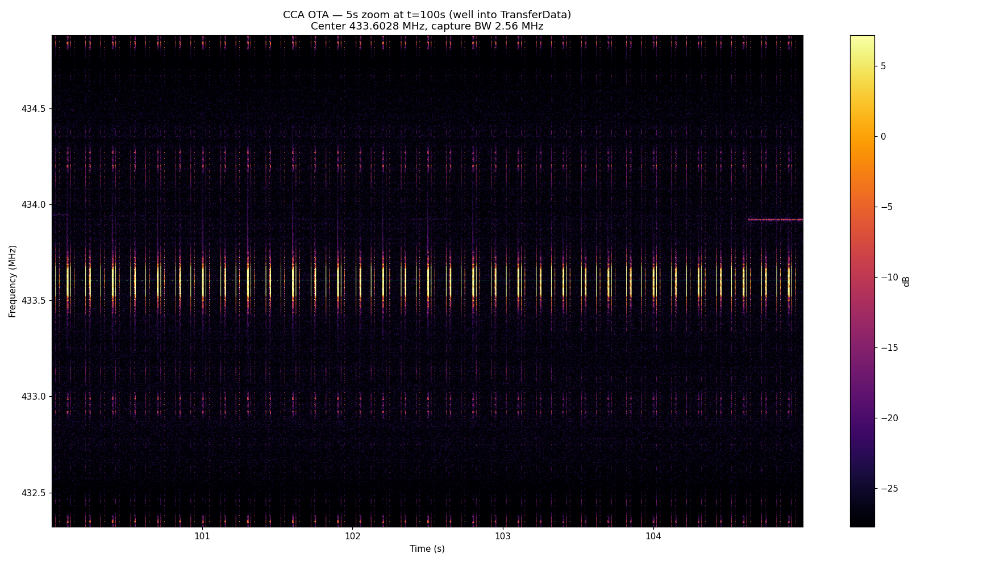
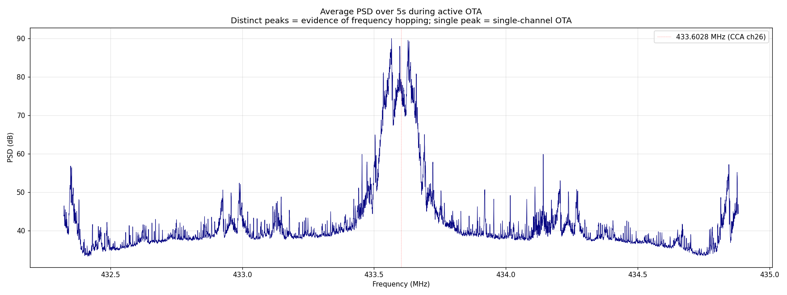

# CCA OTA — live capture findings (2026-04-28)

First successful end-to-end live capture of a CCA firmware OTA, run against a
rooted Caseta Pro / RA2 Select REP2 bridge with a paired DVRF-6L dimmer
(Vogelkop family, DeviceClass `0x04630201`, factory firmware `003.021`).

This page documents what the static RE got right, what it got wrong, and the
force-trigger procedure that bypasses the cloud-side gating.

## TL;DR

- **OTA is single-channel, ~433.566 MHz, ~80 kHz BW** — NOT the 35-channel hop
  the static-RE'd PowPak hop table (`docs/firmware-re/powpak.md`) suggested.
  That hop table is something else (calibration LUT, retry channels, or unrelated).
- **Center frequency offset 36 kHz below runtime CCA** (`433.602844 MHz`),
  consistent with the `MDMCFG3=0x3B` 30.49 kbps GFSK modem config (different
  MCSM gating from runtime).
- **Wire framing matches static RE** — preamble, sync `FA DE`, length-prefixed
  `[LEN][OP][BODY][CRC16]`. Confirmed by visible packet bursts in the capture
  spectrogram. Per-opcode body decoding awaits a working GFSK demod.
- **The cloud check (`firmwareUpgrade.sh`) is a dead end** for force-triggering.
  The Lutron app's "Check for firmware updates" button bypasses cloud entirely
  and goes straight to `leap-server`'s `devicefwu` module.

## Spectrogram evidence

5-second window during the active TransferData phase (~100 s into the
recording), 2.56 MHz capture bandwidth centered on `433.602844 MHz`:



Vertical bursts at a single ~80 kHz-wide band centered slightly below the
runtime CCA channel. No frequency hopping visible.

Average PSD over the same window:



Single dominant peak at **433.5663 MHz** (-36 kHz from runtime CCA center).
Energy span across the 99.5th percentile bins: **433.5594 MHz to 433.6388 MHz**
(~80 kHz wide). If this were a 35-channel hop at ~92 kHz spacing, we'd see
~3.2 MHz of total span and 35 distinct peaks; we see one.

## Force-trigger procedure (rooted Caseta Pro REP2)

The bridge will only push an OTA when its `leap-server`'s `devicefwu` module
decides "this device's running version is older than the manifest version."
That decision uses leap-server's in-memory device-firmware cache, which is
seeded from `Device.FirmwareRevision` in the runtime DB at leap-server start.

### Step 1 — apply DB spoofs

The runtime DB at `/var/db/lutron-db.sqlite`:

- `Device.ActionRequiredID` is constrained to `(0, 6, 8)` by a CHECK constraint —
  cannot directly set `9` ("Device Firmware Update Required"). Spoofing only
  `FirmwareRevision` is sufficient for leap-server's eligibility check, but
  `LinkNodeAssociations.ActionRequiredID = 9` provides belt-and-suspenders for
  any other consumer of the `GetDeviceSerialNumbersRequiringNonComponentConfiguration`
  view.

```sh
sqlite3 /var/db/lutron-db.sqlite "
  UPDATE Device
    SET FirmwareRevision = '003.020'
    WHERE SerialNumber = 117342240;
  UPDATE LinkNodeAssociations
    SET ActionRequiredID = 9
    WHERE LinkNodeAssociationsID = 4;
"
```

`SerialNumber` is the device's factory serial (decimal). `LinkNodeAssociationsID`
is the row joining your device's `LinkNode` to the bridge's; one query to
confirm it before applying:

```sh
sqlite3 -header /var/db/lutron-db.sqlite "
  SELECT LinkNodeAssociationsID, SrcLinkNodeID, DestLinkNodeID, ActionRequiredID
    FROM LinkNodeAssociations
    WHERE DestLinkNodeID IN (
      SELECT LinkNodeID FROM LinkNode WHERE DeviceID = (
        SELECT DeviceID FROM Device WHERE SerialNumber = 117342240
      )
    );
"
```

### Step 2 — bounce leap-server

leap-server caches the `Device.FirmwareRevision` value in memory at startup.
Without a bounce, the spoof has no effect.

```sh
/etc/init.d/K26-leap-server restart
```

(`S74-leap-server` is the start-side symlink; `K26-leap-server` is the same
script and supports `start|stop|restart`.)

### Step 3 — trigger from the Lutron app

Tap **Check for firmware updates** in the app. This sends a LEAP message to
`leap-server` which:

1. Re-parses the manifest at `/opt/lutron/device_firmware/device-firmware-manifest.json`
2. Runs `Plinko` against its in-memory device cache
3. If any device's cached `FirmwareRevision` is below the manifest version for
   its `DeviceClass`, fires `devicefwu: Starting update of N device(s)`
4. lutron-core picks up the IPC and starts the per-device CCA OTA via the
   coproc

We never figured out how to trigger this without the app — the periodic timer
(`ScheduledDeviceFirmwareUpdateTimeoutSeconds`, daily-ish) is too slow to be
practical, and the lower-level `RequestStartFirmwareAutoApply` IPC isn't
socket-callable from outside (returns `No command parser registered`).

### Observed log timeline (DVRF-6L, Vogelkop `003.021`)

```
21:04:37 leap-server: devicefw: Package cache stale, attempting to parse package version
21:04:37 leap-server: devicefw: Package cache parse succeeded
                      (initial app-connect plinko: "no changes required" — cache not yet refreshed)
21:04:41…21:04:53 lutron-core: Goto level: ... ObjectUid={2, 0x000F}
                      (visible "preparing" feedback driving the dimmer up/down)
21:05:16 leap-server: devicefwu: Starting update of 1 device(s)
21:05:16 leap-server: devicefwu: Starting update of device with serial 117342240
                      (≈40 s after the button tap — the Plinko re-fire that read our spoof)
21:06:08 lutron-core: Coproc Health Statistics: UI Queue data high water mark 2.35% → 3.92%
                      (sole evidence of OTA traffic in lutron-core logs — no per-phase logging)
21:24:03 lutron-core: Initializing device records after firmware update for Serial=0x06FE8020
21:24:03 lutron-core: data-transfer-receiver: Data transfer complete
21:24:05 leap-server: devicefwu: Successfully updated SerialNumber 117342240
                      to CodeRevision: 003.021 and PartNumber: 0790116
21:24:05 leap-server: devicefwu: All devices have finished updating
```

Total OTA: **18 minutes 49 seconds** (start to "Data transfer complete"),
within the manifest's `EstimatedFastUploadTimeInSeconds: 1200` envelope.

### Step 4 — cleanup

```sh
sqlite3 /var/db/lutron-db.sqlite "
  UPDATE LinkNodeAssociations
    SET ActionRequiredID = 0
    WHERE LinkNodeAssociationsID = 4;
"
```

After successful OTA, lutron-core auto-overwrites `Device.FirmwareRevision`
back to the device's actual reported value (`003.021`), so that field is
self-cleaning.

## What lutron-core does not log

The OTA we captured ran for 19 minutes with **only two firmware-related
lutron-core log entries** (`Initializing device records after firmware update`
and `data-transfer-receiver: Data transfer complete`, both at the very end).
The per-phase IPCs (`RequestFirmwareUpdateQueryDevice`, `BeginTransfer`,
`ChangeAddressOffset`, `TransferData`×N, `EndTransfer`, `CodeRevision`,
`ResetDevice`) are not surfaced at the default log level. The coproc UI Queue
high-water-mark bump (2.35% → 3.92% → back) is the only proxy signal for OTA
traffic in the logs.

This means an empirical **per-phase-byte correlation must come from the RF
capture, not the log**. The log gives us start/end timestamps; everything
between is in the IQ stream.

## Outstanding work

To turn the 6.1 GB capture into a phase-byte transcript:

1. Build a GFSK demodulator (30.49 kbps, ~32 kHz deviation, ~162 kHz BW) on
   the existing `lib/cca-ota-codec.ts` byte/bit primitives. Validate against
   synthesized signals first (TDD) then against this real capture.
2. Run the demod over the full 19-minute active window. Expect ~5 minutes of
   wall-clock processing for 6.1 GB at 2.56 MHz.
3. Extract opcodes and bodies via `extractPacketsFromBits`. The single-channel
   center makes mixing/decimation trivial — just frequency-shift by -36 kHz
   and decimate to ~256 ksps.
4. Resolve the body sub-opcode discriminator that distinguishes the three
   `0x32` Control phases (`ChangeAddressOffset` / `EndTransfer` / `ResetDevice`),
   completing Open Question #1 in [caseta-cca-ota.md](caseta-cca-ota.md).

## Methodology validation

Cross-reference of the runtime CCA pairing capture (separate session, same
laptop+SDR setup) decoded cleanly via the existing `tools/rtlsdr-cca-decode.ts`
with all 8 documented pairing phases visible (idle/active beacons, PAIR_B0
device announce, A1/A2/A3 config, format 0x15 trim, format 0x0A LED, 6-round
handshake commit). The pairing capture corroborates PR #35 (no-crypto handshake)
and PR #36 (4-arm dispatch by `type & 0xC0`) byte-for-byte against the
documented byte layouts.

The OTA capture, once decoded, will play the same role for [§9 of cca.md](../protocols/cca.md#9-firmware-ota-wire-protocol).
